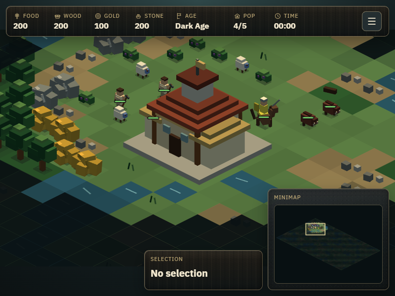
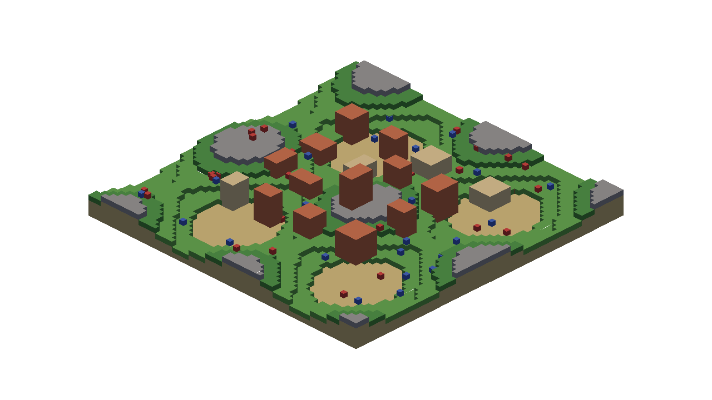
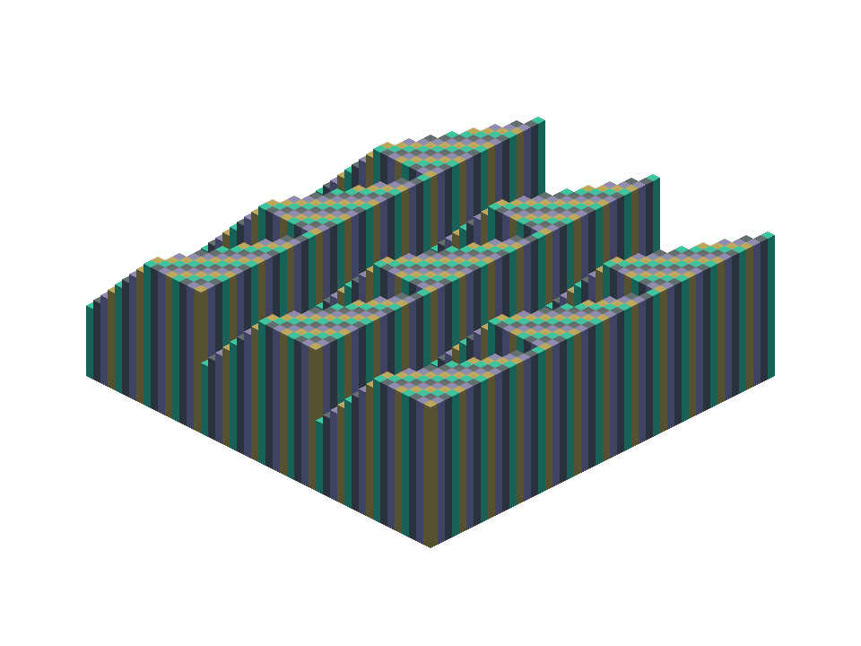
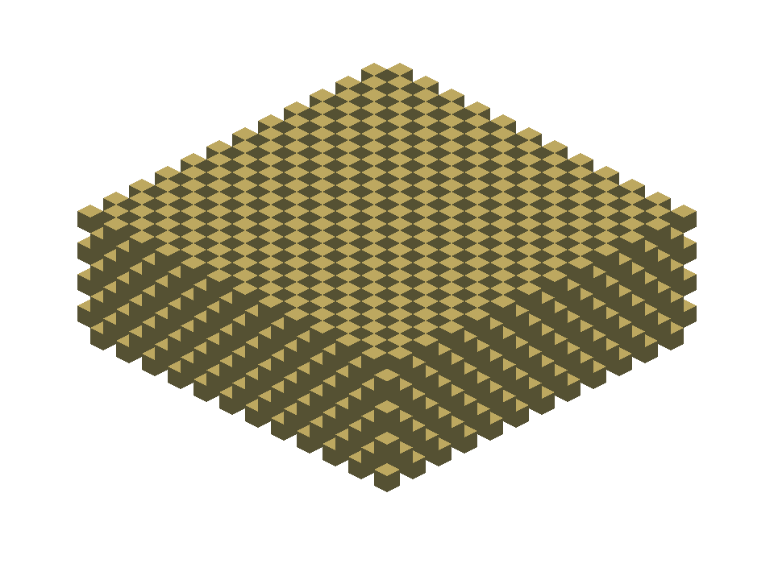
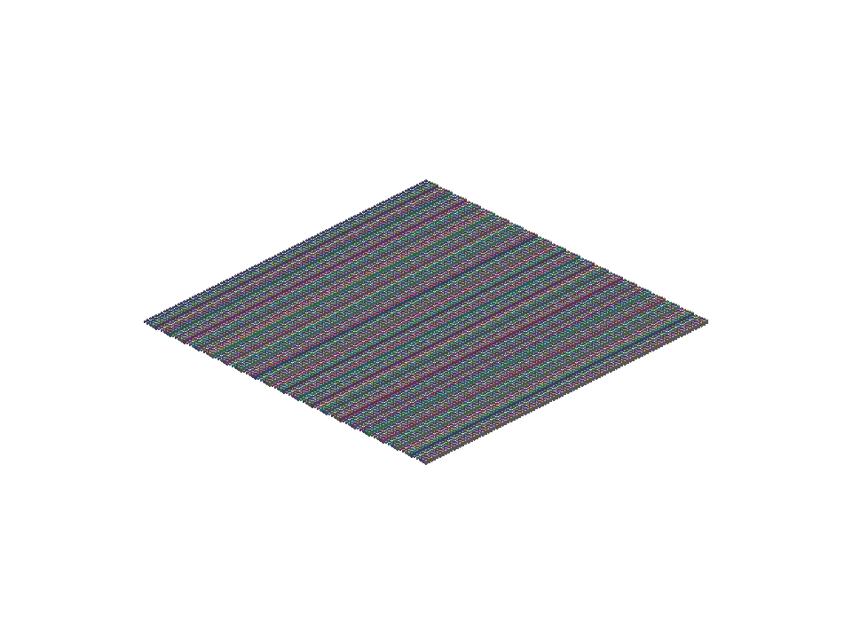

# voxel

`voxel` is a browser-first, voxel-first 3D rendering toolkit for strategy and building games, shared by the sibling `city`, `townscaper`, and `aoe2` repositories.

A game keeps its own simulation, rules, UI, and save data, and sends this engine plain versioned data — voxel chunks, meshes, instanced objects, cameras, motion. The engine turns that into WebGL frames through Three.js and hands back exactly what it drew: metrics, captures, and picking that always agree with the pixels on screen. It is voxel-first, not voxel-only: chunked voxel terrain, low-poly procedural geometry, repeated instanced entities, and orthographic or perspective views all cross the same boundary.



*A real consumer: AoE2 runs Voxel as its sole world renderer — terrain, buildings, villagers, animals, and animation are all engine-drawn; the HUD is the game's own DOM. (Capture from AoE2's devlog, 2026-07-12.)*



*One world carrying both lanes at once: worker-meshed chunk terrain plus two instanced batches — 16 chunks, 76 instances, 18 draw calls. Reproducible with `node scripts/render-showcase.mjs`; the same deterministic scenes back the visual-baseline tests and the named-hardware benchmarks.*

|  |  |  |
| --- | --- | --- |
| Stepped chunk field, greedy-meshed: 14,796 triangles, 9 draw calls. | The worst case on purpose — every cell isolated: 27,648 triangles. | 10,000 instanced boxes, one draw call. A sparse 100-instance update presents in ~0.5 ms on named hardware. |

## What the engine owns

- Game-neutral render snapshot and delta contracts: bounded, structured-clone-safe, versioned data with explicit coordinate, color, and ownership conventions. No callbacks, no DOM objects, no game types.
- Chunk storage, dirty-region invalidation, deterministic voxel meshing (a visible-face oracle plus the measured greedy production mesher), and a packaged Three-free module worker with a bounded scheduler and stale-result firewalls.
- Instanced batches with fixed-page sparse updates, resource caches, orthographic/perspective/borrowed cameras, engine-owned daylight, and injected-time rigid-instance animation.
- A revision-atomic frame transaction: accepted state and presented state are tracked separately, mesh swaps commit at frame boundaries, and an accepted-but-unmeshed revision never produces a mixed frame.
- Presented-state picking and revision-aware capture that read the same committed frame the canvas shows.
- Explicit lifecycle everywhere: context loss and restoration as a state machine, idempotent disposal, and metrics for draw calls, triangles, staging bytes, queue depths, and GPU resource counts.
- Deterministic test tooling: geometry oracles, browser suites, visual baselines, endurance runs, and named reference scenes recorded on named hardware.

Each game keeps simulation, gameplay rules, UI, art direction, and the adapter that translates its state into engine inputs.

## Package surface

- `voxel/core` — V1 snapshot/delta contracts, bounded validation/copying, immutable canonical lanes, coordinates, and the accepted/presented `RenderWorld` lifecycle.
- `voxel/meshing` — dense palette chunks, uniform profiles and indexed adjacency/invalidation, deterministic pure mesher contracts, copied-halo visible-face oracle and greedy production mesher, packaged worker protocol/runtime, bounded scheduler, and a Three-free bounded DDA occupancy ray query.
- `voxel/meshing/browser-worker` — the browser-only bundler entry that starts Voxel's packaged module worker; portable and custom hosts use the factory API from `voxel/meshing`.
- `voxel/three` — the Three.js WebGL runtime: snapshot/delta ingest, runtime-rendered and host-managed frame modes, chunk and instance presentation, cameras, daylight, deterministic playback, presented picking, capture, metrics, lifecycle, and disposal.
- `voxel/testing` — consumer-independent test helpers: reference scenes, a clock-free frame-budget reporter, the frozen mesher corpus, and deterministic ownership hooks.

The runtime is tested with `three@0.185.1` and `@types/three@0.185.0`. `three` is a narrow optional peer so core and meshing stay renderer-independent; applications importing `voxel/three` must install the tested Three runtime and deduplicate linked copies.

## Status

The 1.0 feature surface is complete and evidence-gated: foundations, atomic deltas, the production voxel pipeline, presented-state picking, host/camera/context lifecycle, and both consumer proofs — AoE2 standalone as its sole world renderer, City drawing its building wall lane through an embedded, borrowed-renderer runtime. Hardening evidence is recorded: a pinned hostile-input fuzz corpus, endurance runs that hold resource counts flat over 1,000 edits and repeated real context losses, visual baselines, a supply-chain gate, green Windows/Linux CI, and eight named reference scenes measured on named hardware ([benchmarks/results/](benchmarks/results/)) — a boundary edit through the worker path presents in ~38 ms p50, a 50k-instance sparse patch in ~1.3 ms, a pick query in ~0.1 ms on an RTX 4090.

Release-candidate work — API/schema freeze, clean-consumer rehearsal, adversarial review, and the immutable tagged artifact — is governed by [the roadmap](docs/plans/v1-roadmap.md) and tracked in [the implementation plan](docs/plans/v1-implementation.md).

Deliberately out of 1.0: WebGPU, LOD, streaming, smooth terrain, skeletal animation, transparency-aware voxel merging, and public registry publication. The reasons are recorded in the roadmap's scope boundaries.

## Getting started

```bash
npm install
npm run test:browser:install
npm run verify
npm pack --dry-run
```

New to this codebase? [The concepts guide](docs/guides/concepts.md) explains the vocabulary the rest of the documentation assumes — epochs, accepted versus presented, meshing, the frame transaction, and host ownership — in plain language, with the bug each idea prevents.

See [the consumer integration guide](docs/guides/consumer-integration.md) for the lifecycle and game-owned adapter boundary. [The current engine design](docs/design/spec.md) and [0.1 implementation ledger](docs/plans/implementation.md) record the delivered vertical slice. The forward 1.0 authority is [the roadmap](docs/plans/v1-roadmap.md), [target architecture](docs/design/v1-architecture.md), and [implementation plan](docs/plans/v1-implementation.md); [the support policy](docs/policies/support.md) defines when a platform or artifact becomes supported. [The ecosystem review](docs/research/ecosystem.md) records which mature libraries are adopted, evaluated, or rejected.

The repository also hosts the model studio (`npm run studio`) — a browser workbench for the voxel models the games ship: frame-by-frame playback, pinned notes, agent-drivable controls, and models saved as the recipes that made them ([design](docs/superpowers/specs/2026-07-17-model-recipes-and-shared-parts-design.md)).
