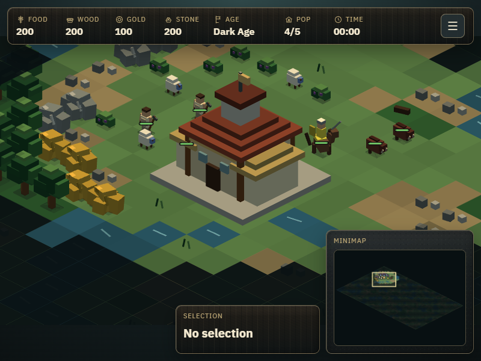
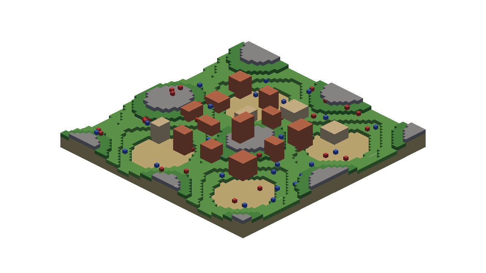
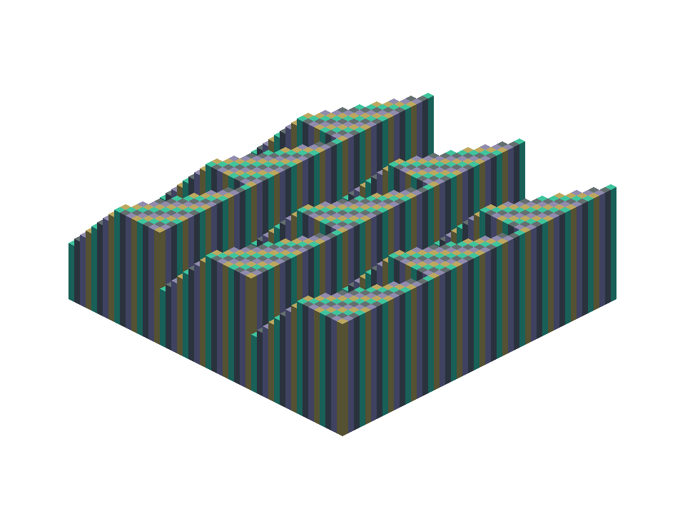
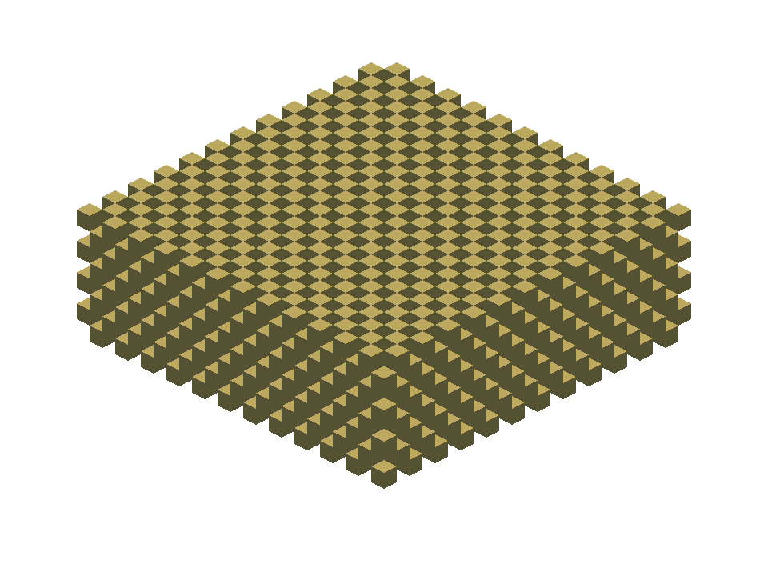
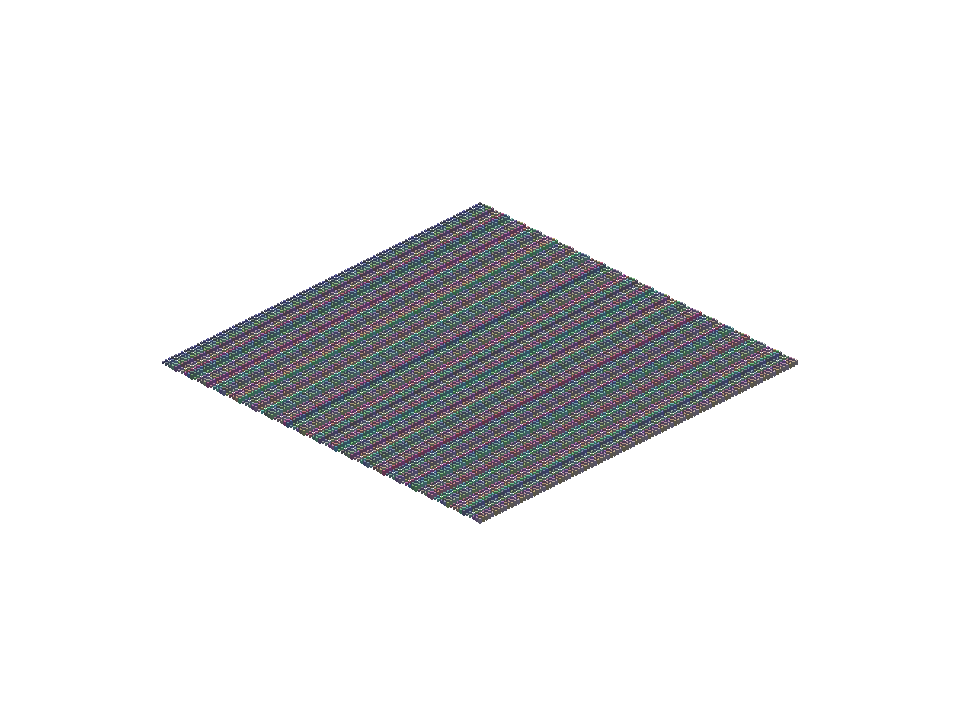

# voxel

`voxel` is a browser-first, voxel-first 3D rendering toolkit for strategy and building games, built for the sibling `city`, `townscaper`, and `aoe2` repositories. AoE2 uses it as the sole world renderer, City proves an opt-in embedded building-wall lane, and Townscaper adoption remains planned.

A game keeps its own simulation, rules, UI, and save data, and sends this engine plain versioned data — voxel chunks, meshes, instanced objects, cameras, motion. The engine turns that into WebGL frames through Three.js and hands back metrics and revision-aware captures. For worlds whose descriptor carries `chunkProfile` and whose runtime enables `voxelWorkers`, committed voxel/instance picking reads exactly the same presented frame as the canvas. An otherwise-running world outside that path reports `no-presented-frame`; lifecycle states such as lost or disposed return their own typed unavailable outcome. It is voxel-first, not voxel-only: chunked voxel terrain, low-poly procedural geometry, repeated instanced entities, and orthographic or perspective views all cross the same boundary.



*A real consumer: AoE2 runs Voxel as its sole world renderer — terrain, buildings, villagers, animals, and animation are all engine-drawn; the HUD is the game's own DOM. (Capture from AoE2's devlog, 2026-07-12.)*



*One world carrying both lanes at once: worker-meshed chunk terrain plus two instanced batches — 16 chunks, 76 instances, 18 draw calls. Reproducible with `node scripts/render-showcase.mjs`; the same deterministic scenes back the visual-baseline tests and the named-hardware benchmarks.*

|  |  |  |
| --- | --- | --- |
| Stepped chunk field, greedy-meshed: 14,796 triangles, 9 draw calls. | The worst case on purpose — every cell isolated: 27,648 triangles. | 10,000 instanced boxes, one draw call. A sparse 100-instance update presents in ~0.5 ms on named hardware. |

## What the engine owns

- Game-neutral render snapshot and delta contracts: bounded, structured-clone-safe, versioned data with explicit coordinate, color, and ownership conventions. No callbacks, no DOM objects, no game types.
- Chunk storage, dirty-region invalidation, deterministic voxel meshing (a visible-face oracle plus the measured greedy production mesher), and a packaged Three-free module worker with a bounded scheduler and stale-result firewalls.
- Instanced batches with fixed-page sparse updates, resource caches, orthographic/perspective/borrowed cameras, engine-owned daylight, and injected-time rigid-instance animation.
- A revision-atomic frame transaction: accepted state and presented state are tracked separately, mesh swaps commit at frame boundaries, and an accepted-but-unmeshed revision never produces a mixed frame.
- Committed voxel/instance picking for profiled `chunkProfile` worlds presented through `voxelWorkers`; otherwise-running worlds outside that path report `no-presented-frame`, and lifecycle states have distinct unavailable outcomes. Revision-aware capture reads the same committed frame the canvas shows.
- Explicit lifecycle everywhere: context loss and restoration as a state machine, idempotent disposal, and metrics for draw calls, triangles, staging bytes, queue depths, and GPU resource counts.
- Deterministic test tooling: geometry oracles, browser suites, visual baselines, endurance runs, and named reference scenes recorded on named hardware.

Each game keeps simulation, gameplay rules, UI, art direction, and the adapter that translates its state into engine inputs.

## Package surface

- `voxel/core` — V1 snapshot/delta contracts, bounded validation/copying, immutable canonical lanes, coordinates, and the accepted/presented `RenderWorld` lifecycle.
- `voxel/meshing` — dense palette chunks, uniform profiles and indexed adjacency/invalidation, deterministic pure mesher contracts, copied-halo visible-face oracle and greedy production mesher, packaged worker protocol/runtime, bounded scheduler, and a Three-free bounded DDA occupancy ray query.
- `voxel/meshing/browser-worker` — the browser-only bundler entry that starts Voxel's packaged module worker; portable and custom hosts use the factory API from `voxel/meshing`.
- `voxel/three` — the Three.js WebGL runtime: snapshot/delta ingest, runtime-rendered and host-managed frame modes, chunk and instance presentation, cameras, daylight, deterministic playback, committed picking for profiled `voxelWorkers` worlds, capture, metrics, lifecycle, and disposal.
- `voxel/testing` — consumer-independent test helpers: reference scenes, a clock-free frame-budget reporter, the frozen mesher corpus, and deterministic ownership hooks.

The runtime is tested with `three@0.185.1` and `@types/three@0.185.0`. `three` is a narrow optional peer so core and meshing stay renderer-independent; applications importing `voxel/three` must install the tested Three runtime and deduplicate linked copies.

## Status

**Version 1.0.0** — stable. Foundations, atomic deltas, the production voxel pipeline, committed presented-state picking for profiled `voxelWorkers` worlds, host/camera/context lifecycle, and both consumer proofs are delivered: AoE2 runs Voxel standalone as its sole world renderer, and City draws its building wall lane through an embedded, borrowed-renderer runtime. The frozen 1.0 candidate's hardening evidence records 760 unit tests across 92 files, 11 real-browser tests including visual baselines, a pinned hostile-input fuzz corpus, endurance runs that hold resource counts flat over 1,000 edits and 30 real device losses, a supply-chain gate, green Windows/Linux CI, and eight named reference scenes measured on named hardware ([benchmarks/results/](benchmarks/results/)) — a boundary edit through the worker path presents in ~38 ms p50, a 50k-instance sparse patch in ~1.3 ms, a pick query in ~0.1 ms on an RTX 4090. Post-release model-studio coverage brings the current repository to 1,238 unit tests across 146 files; the complete gate and all 58 browser tests remain green.

Public declarations, schema literals, delta operation discriminants, and the support matrix are frozen; changing any of them means a major release. [The support policy](docs/policies/support.md) defines the supported platforms and the evidence each claim rests on, and [the changelog](CHANGELOG.md) records what 1.0 contains. Distribution is a private tag and packed artifact; registry publication is a separate decision.

Not in the current release: imported asset and GLTF APIs, public extension or logical-pick-proxy APIs, a public dynamic-light resource/API, generic render passes, autonomous scheduling, spatial sharding, WebGPU, LOD, streaming, smooth terrain, skeletal animation, transparency-aware voxel merging, engine-owned shadow or post-processing policy, Townscaper package adoption, and public registry publication. [The roadmap's scope boundaries](docs/plans/v1-roadmap.md#scope-boundaries) record the deliberate 1.0 exclusions and decision gates.

## Getting started

```bash
npm install
npm run test:browser:install
npm run verify
npm pack --dry-run
```

New to this codebase? [The concepts guide](docs/guides/concepts.md) explains the vocabulary the rest of the documentation assumes — epochs, accepted versus presented, meshing, the frame transaction, and host ownership — in plain language, with the bug each idea prevents.

See [the consumer integration guide](docs/guides/consumer-integration.md) for the lifecycle and game-owned adapter boundary, and [the model studio guide](docs/guides/model-studio.md) for standing up a game's own studio. The private Three-free `@voxel/model-studio-ui` file package owns one workbench, five-tab vocabulary, accessibility contract, and visual baseline for every game; renderer/content adapters keep each game's scene, catalog, parts, recipes, and review semantics. [The current engine design](docs/design/spec.md) and [0.1 implementation ledger](docs/plans/implementation.md) record the delivered vertical slice. The delivered 1.0 record is [the roadmap](docs/plans/v1-roadmap.md), [target architecture](docs/design/v1-architecture.md), and [implementation plan](docs/plans/v1-implementation.md); [the support policy](docs/policies/support.md) defines supported platforms and the evidence behind each claim. [The ecosystem review](docs/research/ecosystem.md) records which mature libraries are adopted, evaluated, or rejected.

Use the [Create Diverse Voxel Assets skill](docs/skills/create-diverse-voxel-assets/SKILL.md) for the end-to-end engine and downstream-game workflow: creative briefs, structural exploration, reproducible recipes, evidence-driven promotion, coherent system scenes, and consumer-boundary verification.

The repository also hosts the model studio (`npm run studio`) — a browser workbench for the voxel models the games ship: frame-by-frame playback, pinned notes, agent-drivable controls, models saved as the recipes that made them, and scenes that stand those models together in one world with editable local point lights ([design](docs/superpowers/specs/2026-07-17-model-recipes-and-shared-parts-design.md)). Its internal clustered-light proof accepts up to 4,096 authored point lights, evaluates at most 32 local influences per fragment, draws every light marker in one instanced call, and includes a built-in proof where 1,000 full-spectrum lights move on three axes around 1,000 neutral receivers. Lighting and scene movement are separate persisted controls: lighting-off sources remain dim edit handles, while the scene-animation button and shared Play/Pause transport govern moving sources, animated model placements, and consumer-supplied pose replays. The proof has no shadows and is not a public 1.0 dynamic-light API. [The model studio guide](docs/guides/model-studio.md#scenes) records the proof's exact limits and current transaction boundary.

The current sealed [named-hardware benchmark](benchmarks/results/2026-07-26T06-22-55-772Z-clustered-lights-1000.json) of commit `ec2f3ea` measured the full 1,000-light and 1,000-receiver proof at 1,208.8 GPU-synchronized uncapped Studio draws/s on an RTX 4090 at 1280×720, with 0.80/0.90/1.10 ms frame p50/p95/p99, 148,000 triangles, two draw calls, and a measured maximum of 11/32 lights in one cluster. This is microbenchmark throughput for deterministic Studio draws, not display-refresh FPS, gameplay FPS, or a full game-sized world.

The built-in Studio catalog also carries 30 manually curated contrast recipes across six shape families and four neutral domains, backed by seven reusable shape-changing parts and four honestly labeled domain contact sheets; four semantically animated models across three sheets make the persisted scene-animation control useful beyond lighting. **Machine Works** is a separate fifth system scene built from ten reusable assembly-line recipes, their exact physical sidecars, and one reused continuous-side-guide service gantry. Fifty-eight 26-voxel-deep kinematic slats form a closely pitched articulated belt loop around two internal drive drums, with each underside following the nominal 2.75-unit drum pitch datum and bounded straight and turn clearances. An exact sidecar OBB/SAT regression samples all 58 slats against both pitch drums at 32 phases: slat-edge and drum-end-cheek compounds may share a boundary but have zero positive-volume overlap, the central barrel retains at least about 0.275 world units of radial clearance, and an intentionally shifted negative control must overlap. Four exposed axle cogs reuse one exact cataloged kinematic cog recipe and sidecar, but they never enter Rapier: the consumer derives their four non-interacting replay tracks from the solved drive-drum poses, so all 64 presented slat, drive-drum, and exposed-cog elements share one hashed drive phase while the cogs prove only visible axle-phase agreement. Rapier contact and friction, rather than a prescribed carrier X trajectory or cog contact, transport an axis-constrained dynamic carrier aligned with the visible foundation guards through two insertion stations without claiming physical guide contact. The fixture validates named mating ports before merging a three-piece compound product and runs paired same-geometry 240-tick ablations containing the complete causal world of foundation, slats, drive drums, carrier, and jointed load: zero drive must keep maximum displacement within 0.05 world units, while driven zero friction must keep maximum displacement within 20 percent of the driven trace's maximum over the same interval. Only after belt contact brings the carrier within the hashed X, Y, Z, orientation, and speed bounds does the explicit position servo capture that exact validated physical handoff pose and begin there without a positional or rotational snap, visibly tip the still-colliding carrier, and release the product to gravity; the real bucket contact manifold and declared collection sensor then gate collection with a hashed 0.05-unit containment tolerance. Its committed 30-second replay carries 71 pose tracks across 1,800 fixed-step frames, presents 73 scene instances including two static supports, and records assembly, release, contact, and collection at about 11.67, 18.33, 20.95, and 24.15 seconds; the final frame holds until one discrete reset at exactly 30 seconds. The gantry rests on the foundation and keeps both externally prescribed kinematic heads visually aligned through their full strokes, but it is an explicitly non-colliding presentation frame rather than a solver support. Studio defensively owns the V4 trace and presents it through ordinary sparse renderer deltas, so the reusable pattern is recipes plus physical sidecars plus a consumer-owned deterministic trace rather than a Machine Works branch in the renderer. Voxel does not run the solver, and the fixture claims synchronized frictional transport only: it does not prove exposed-cog contact, cog torque transmission, belt tension or compliance, tooth engagement, arbitrary-load no-slip behavior, arbitrary machinery, or “all physics laws.” Palette or seed-only variants do not count: promotion requires contrast with the nearest catalog neighbors on at least two independent axes such as topology and negative space, multi-view silhouette and massing, scale and proportion, construction grammar, material rhythm, or supported motion. The dev-time `fingerprintStudioModelV1` and `analyzeStudioCatalogDiversityV1` APIs provide deterministic raw evidence, while `npm run studio:diversity` writes fixed four-yaw contact sheets, a four-phase motion sheet, and reports under ignored `output/playwright/studio-diversity/`; a manually reviewed static fixture pins accepted outputs and is never rewritten automatically. The bounded candidate pass generates 64 candidates per family, rejects empty, duplicate, invalid, and quantitatively weak proposals, and preserves rebuildable recipes plus rejection evidence to make exploration broad and selection narrow, but it neither auto-promotes assets nor adds runtime asset evolution or a public runtime/schema surface.

**Riverfall canyon** is a separate system scene and the sixth curated Studio proof scene: seven reusable opaque-voxel recipes compose one high river, framed cliff fall, receiving pond, foam field, and outflow while ten uniquely seeded tree placements line both banks. Twenty-four instanced cyan glints traverse one hash-pinned path at constant arc length from river to fall to pond; the return sinks inside the outflow, runs below the opaque foundation, and rises inside the source bed. The six-second V1 replay records an endpoint-identical final pose and holds it for only 10 ms before reset, avoiding a visible wrap pop without changing the physical-trace replay contract. The fixed browser proof checks game-look lit renders from default, overhead, longitudinal, and reverse cameras plus a distinct flow phase, and pins 43 instances, 17 draw calls, and 39,668 triangles. This is catalog-authored kinematic visualization over opaque water, not transparency, a fluid solver, hydrology, erosion, or gameplay water state; downstream games can adapt the connected-recipe and plain-path technique by sampling game-owned state into Voxel's ordinary public instance-matrix deltas.

## Part of a fleet

This repo is one of ~two dozen sibling repos kept side by side under a single `github/` working folder. Fleet-wide setup, the governance canon, and the recursive self-improvement loop live in **[loop-ops](https://github.com/yanfengliu/loop-ops)** — on a fresh machine, clone that repo and run `npm run clone-fleet` to rehydrate every repo (including this one) and the shared canon.
